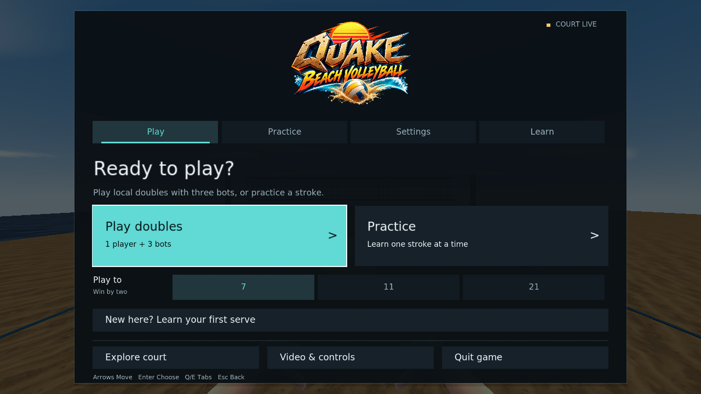
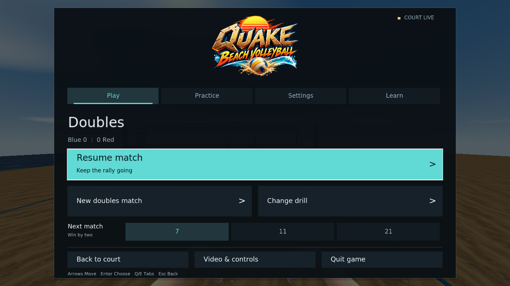
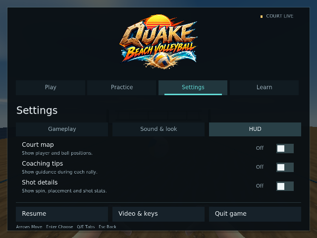
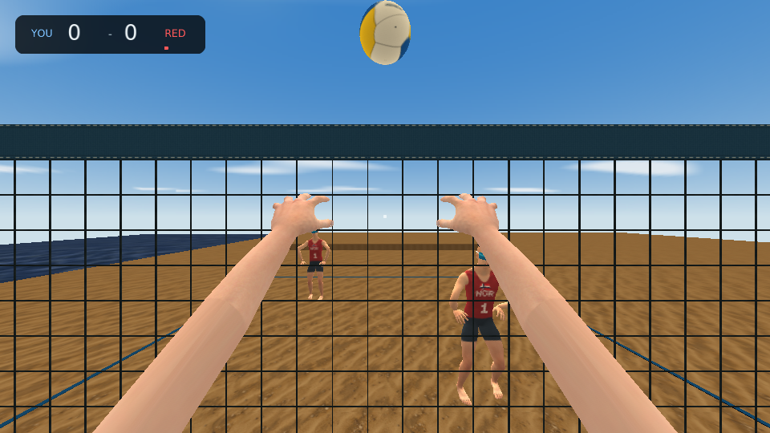
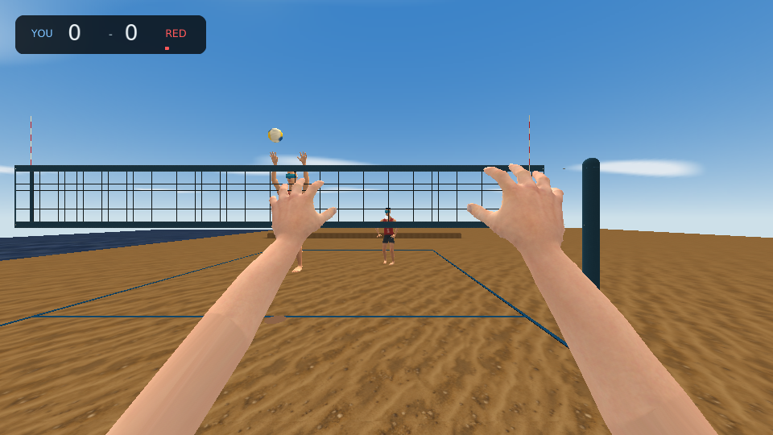

# Quake beach volleyball

<p align="center">
  
</p>

**Aim. Prepare. Meet the ball.**

First-person beach volleyball for [QSS-M](https://github.com/timbergeron/QSS-M).
Learn a stroke in practice, then play doubles with a blue teammate against two
red opponents. Move your feet, shape the shot, and release when the ball reaches
your hands.

**[Download v0.7.0](https://github.com/timbergeron/quake-beach-volleyball/releases/tag/v0.7.0)** ·
[Build the latest](#build-the-latest) · [How to play](docs/gameplay.md)


*Native QSS-M captures: compact HUD, clearer court, and updated hands. The
latest source also adds the game menu and blocking with court coverage. The v0.7.0 download predates these
changes.*

## Start playing

1. Install [QSS-M](https://github.com/timbergeron/QSS-M) and have your Quake
   `id1/pak0.pak` available.
2. Download `beachvolley.zip` from the
   [v0.7.0 release](https://github.com/timbergeron/quake-beach-volleyball/releases/tag/v0.7.0)
   and unpack it into your Quake directory.
3. Launch from that directory:

   ```sh
   quakespasm -game beachvolley -fsaa 4 +exec beach.cfg +map beach
   ```

**Your first serve:** press **R**, aim across the net, hold **LMB** to toss,
and release near the top. Watch the contact feedback and try again. **H** shows
the full controls on court.

The download includes compiled game code and mod assets. Quake game data is
required separately. [Release contents and notes →](docs/releases/v0.7.0.md)

**In the latest source build**, the game menu opens when you arrive:

- **Learn → Try a serve** takes you from a three-step guide straight to practice.
- **Play** starts doubles with three bots. Choose **7, 11, or 21 points** before
  starting; **Resume** becomes the first action once you're on court.
- **Practice** gives each stroke its own drill: serve, receive, set, and attack.
- **Settings** explains each option, with instant switches and draggable sliders.
  **Video & controls** opens the engine options.

Use the mouse, or **Tab / arrows** and **Enter**; **Q / E** switches tabs.
**Escape** or **F1** brings the menu back. The court stays live while browsing.
Changing sessions asks before clearing a doubles score, with **Cancel** selected
first. [Menu and navigation →](docs/gameplay.md#game-menu)

## One good rally

**Get there.** Move into the ball's path and settle your feet.
**Prepare.** Aim toward your teammate, then hold a shot button.
**Meet it.** Release as the ball reaches your hands. Follow the set toward the
net and jump to attack.

| Input | What you need first |
| --- | --- |
| **WASD** / mouse | Move / look |
| Hold → release **LMB** | Prepare → pass or spike |
| Hold → release **RMB** | Prepare → set or airborne roll |
| Hold **RMB** + **Space** near the net | Jump to block an opponent's attack |
| **Space** / **Ctrl** | Jump / dive |
| **Shift + mouse** | Adjust your aim while preparing |
| Wheel / **F**, **V** | Change arc / shorter or deeper placement; cushion a receive |
| **1–4** / **5** | Serve, receive, set, attack drills / local doubles |
| **Escape** / **F1** | Game menu: play, practice, settings, and learning |
| **H** / hold **Tab** | Toggle / show help |

You choose the direction before preparing, so you can look up and track the
ball. **C** toggles assisted contact within physical hand reach. **J** toggles
the optional landing guide. [Full controls, serve timing, and shot shaping →](docs/gameplay.md#controls)

Doubles is one local player plus three bots: receive, set, attack, cover. Games
default to seven points, win by two; the latest menu also offers 11 or 21.
The winning team serves next. Three-touch limits
and double-contact faults are in place. A block counts as the first touch;
the blocker can play the next ball. Full beach rules, service rotation,
side changes, and network doubles are still in development.
[How doubles works →](docs/gameplay.md#doubles-rallies)

**Read the block.** Face the net, hold **RMB**, and jump as the attack arrives.
Your partner covers behind you. On attack, watch the defender commit: hit around
the hands or send a roll over an early jump.
[Blocking and coverage →](docs/gameplay.md#blocking-and-coverage)

## See the game

**An easy place to begin.** Play doubles, choose a focused drill, adjust the
game, or learn your first serve in three steps. Resume keeps your current match
one action away; settings explain what they change. Rounded panels and clear
focus work with a mouse or keyboard, including smaller windows and large HUD scales.



| Resume your match | Choose your HUD · 640 × 480 |
| --- | --- |
|  |  |

**More court. Less HUD.** A compact score, a small aiming dot, and a brief cue
when you need it. The power or timing bar appears only while preparing a shot.
The court map, coaching tips, and shot statistics start off; enable each in
**Settings → HUD**. The landing guide is a separate option under **Gameplay**.


| Read the receive | Time the jump serve |
| --- | --- |
|  |  |

| Time your block | Read their coverage |
| --- | --- |
|  |  |

**Help when you need it.** Controls are grouped by movement and shot shaping.
The compact layout keeps them readable on a smaller viewport.

| Grouped controls | Compact controls · 640 × 480 |
| --- | --- |
|  |  |

<details>
<summary><strong>Look closer: hands, strokes, and equipment</strong></summary>

Deep-dish setting uses flexed fingers and opposed thumbs. Separate motions show
a firm-palm float contact, an inward cut, and a wrist-away cut.


| Float contact · fixed pose | Float serve · live contact |
| --- | --- |
|  |  |

| Inward cut | Wrist-away cut |
| --- | --- |
|  |  |

The athletes wear Norway-inspired navy and red kits, caps, and mirrored shields.
The ball has curved panels and seams; the net has open cord geometry, padded
posts, and tension fittings. These are native engine renders of the game assets.

| Athlete | Volleyball |
| --- | --- |
|  |  |

| Court and net | Padding and hardware |
| --- | --- |
|  |  |

The body has **31 clips / 389 poses**; first-person hands have **32 clips / 402
poses**. [Athlete notes](docs/player.md) · [Hand notes](docs/hands.md) ·
[Model detail and budgets](docs/model-detail.md)

</details>

All screenshots above were captured in QSS-M with 4× anti-aliasing. Live scenes,
fixed poses, and build hashes are recorded in the
[gameplay capture manifest](docs/screenshots/review.json) and
[menu capture manifest](docs/screenshots/menu-review.json).

## Build the latest

Use a current [QSS-M](https://github.com/timbergeron/QSS-M) build for native
rounded HUD panels. Older engines use square panels.

You need Python 3.10+, [md3harness](https://github.com/timbergeron/md3harness),
[FTEQCC](https://github.com/fte-team/fteqw), and
[ericw-tools](https://github.com/ericwa/ericw-tools). Clone md3harness beside this
repository or install its Python package, then run from the repository root:

```sh
python3 build.py --basedir /path/to/quake \
  --fteqcc /path/to/fteqcc \
  --qbsp /path/to/qbsp --vis /path/to/vis --light /path/to/light

python3 run.py --bin /path/to/quakespasm --basedir /path/to/quake --window
```

The build writes `dist/beachvolley` and an install ZIP. The launcher keeps its
runtime and configs in the mod checkout and reads your Quake PAKs through links.
[Setup, asset generation, and verification →](docs/development.md)

## Go deeper

| For players | For makers |
| --- | --- |
| [Game menu](docs/gameplay.md#game-menu) · [Controls and shot timing](docs/gameplay.md#controls) | [Build and test](docs/development.md) |
| [Doubles rallies](docs/gameplay.md#doubles-rallies) | [Athlete animation](docs/player.md) · [First-person hands](docs/hands.md) |
| [Physics and tuning](docs/gameplay.md#physics-and-tuning) | [Texture painting kit](docs/texture-authoring.md) · [Model budgets](docs/model-detail.md) |

Preparation and positioning take inspiration from *Virtua Tennis*. Contact,
flight, and volleyball motions are authored here. Physics and assistance values
are tuned for play rather than calibrated as a sports simulation.
[Design and upstream credits →](THIRD_PARTY.md)

## License

Copyright © 2026 timbergeron. Original source and generated assets use
[GPL-2.0-or-later](LICENSE). Prepared MakeHuman body/hand source and skin are
[CC0](resources/anatomy/LICENSE.CC0.txt). See [third-party credits](THIRD_PARTY.md).
Quake game data is required separately and is not included.
