# Quake beach volleyball

**Aim. Prepare. Meet the ball.**

First-person beach volleyball for [QSS-M](https://github.com/timbergeron/QSS-M).
Learn a stroke in practice, then play doubles with a blue teammate against two
red opponents. Move your feet, shape the shot, and release when the ball reaches
your hands.

**[Download v0.7.0](https://github.com/timbergeron/quake-beach-volleyball/releases/tag/v0.7.0)** ·
[Build the latest](#build-the-latest) · [How to play](docs/gameplay.md)

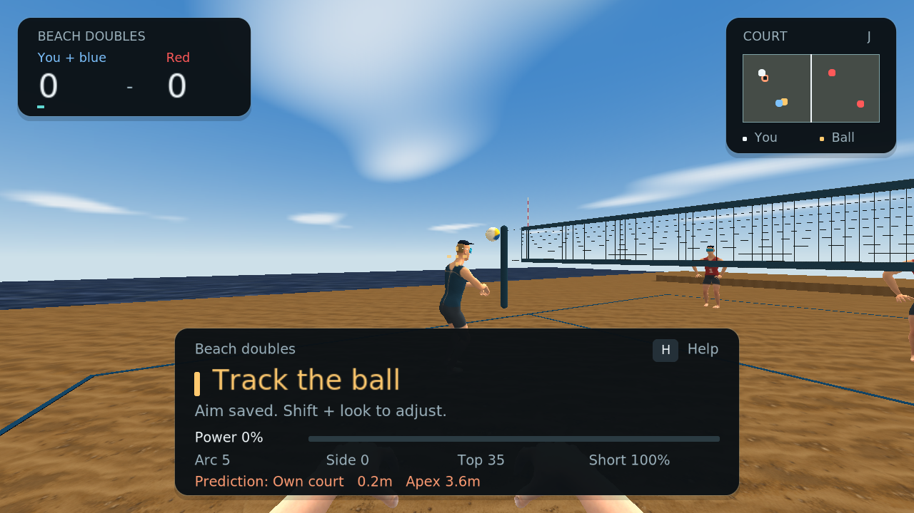

*Native QSS-M captures of the latest source build: rounded HUD, clearer court,
and updated hands. The v0.7.0 download predates these changes.*

## Start playing

1. Install [QSS-M](https://github.com/timbergeron/QSS-M) and have your Quake
   `id1/pak0.pak` available.
2. Download `beachvolley.zip` from the
   [v0.7.0 release](https://github.com/timbergeron/quake-beach-volleyball/releases/tag/v0.7.0)
   and unpack it into your Quake directory.
3. Launch from that directory:

   ```sh
   quakespasm -game beachvolley -fsaa 4 +exec beach.cfg +map beach
   ```

**Your first serve:** press **1**, then **R**. Aim across the net, hold **LMB** to
toss, and release near the top. Watch the contact feedback and try again.
Press **H** for help, or **5** when you are ready for doubles.

The download includes compiled game code and mod assets. Quake game data is
required separately. [Release contents and notes →](docs/releases/v0.7.0.md)

## One good rally

**Get there.** Move into the ball's path and settle your feet.
**Prepare.** Aim toward your teammate, then hold a shot button.
**Meet it.** Release as the ball reaches your hands. Follow the set toward the
net and jump to attack.

| Input | What you need first |
| --- | --- |
| **WASD** / mouse | Move / look |
| Hold → release **LMB** | Prepare → pass or spike |
| Hold → release **RMB** | Prepare → set or airborne roll |
| **Space** / **Ctrl** | Jump / dive |
| **Shift + mouse** | Adjust your aim while preparing |
| Wheel / **F**, **V** | Change arc / shorter or deeper placement; cushion a receive |
| **1–4** / **5** | Serve, receive, set, attack drills / local doubles |
| **H** / hold **Tab** | Toggle / show help |

You choose the direction before preparing, so you can look up and track the
ball. **C** toggles assisted contact within physical hand reach. **J** toggles
training overlays. [Full controls, serve timing, and shot shaping →](docs/gameplay.md#controls)

Doubles is one local player plus three bots: receive, set, attack, cover. Games
are first to seven, win by two; the winning team serves next. Three-touch limits
and double-contact faults are in place. Full beach rules, service rotation,
side changes, and network doubles are still in development.
[How doubles works →](docs/gameplay.md#doubles-rallies)

## See the game

**A clear court. A clear next action.** The current HUD keeps score and court
position in the corners, with one prominent cue for what to do next. Practice
targets live on the minimap; blue lines frame the sand.

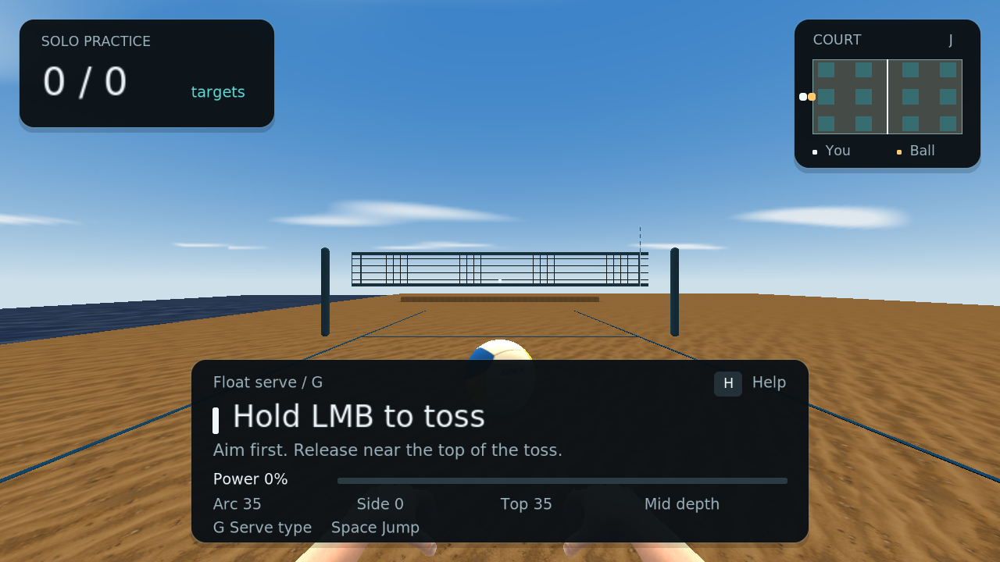

| Read the receive | Time the jump serve |
| --- | --- |
| 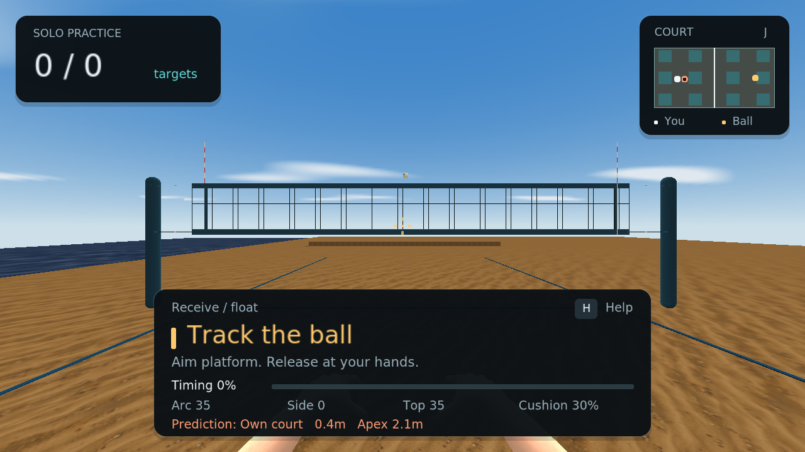 | 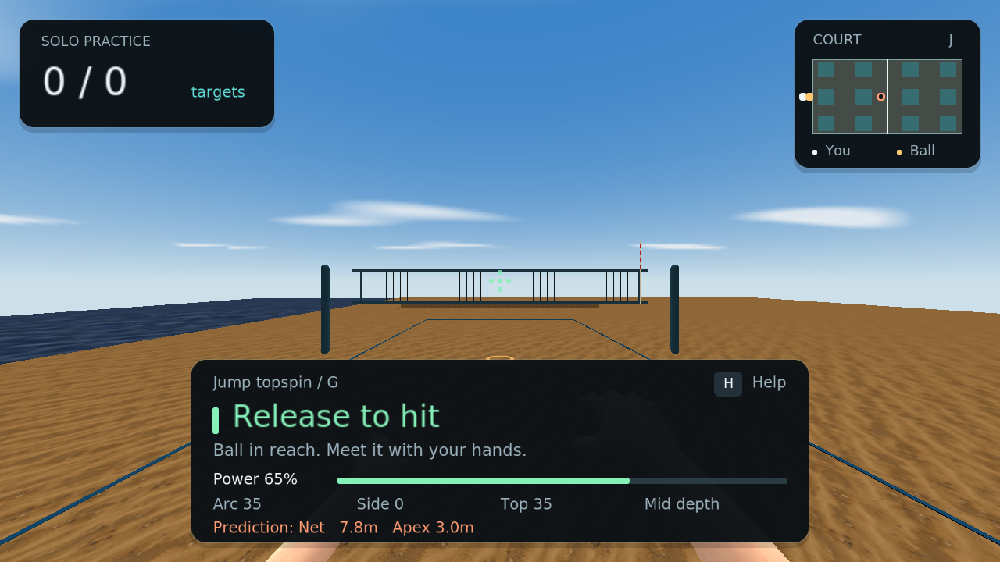 |

**Help when you need it.** Controls are grouped by movement and shot shaping.
The compact layout keeps them readable on a smaller viewport.

| Grouped controls | Compact controls · 640 × 480 |
| --- | --- |
| 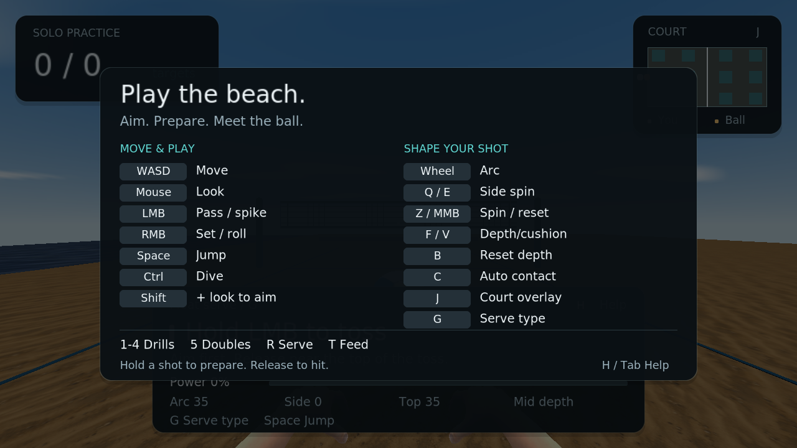 | 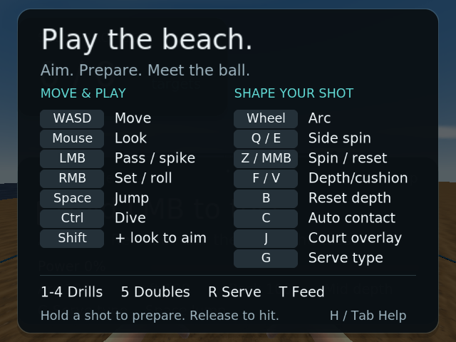 |

<details>
<summary><strong>Look closer: hands, strokes, and equipment</strong></summary>

Deep-dish setting uses flexed fingers and opposed thumbs. Separate motions show
a firm-palm float contact, an inward cut, and a wrist-away cut.


| Float contact · fixed pose | Float serve · live contact |
| --- | --- |
| 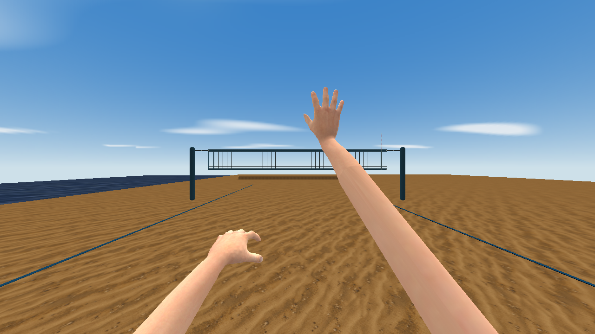 | 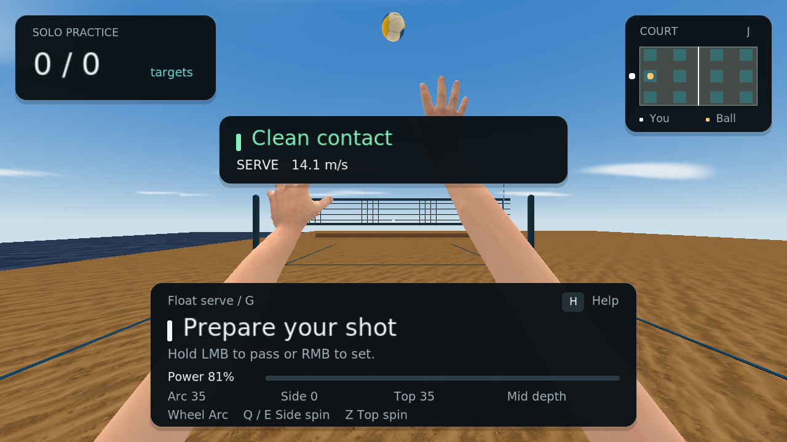 |

| Inward cut | Wrist-away cut |
| --- | --- |
| 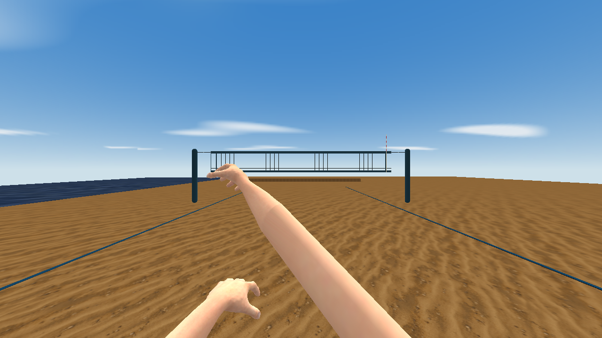 | 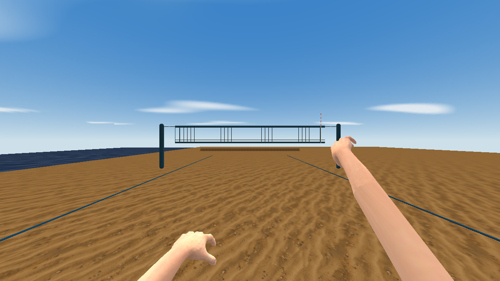 |

The athletes wear Norway-inspired navy and red kits, caps, and mirrored shields.
The ball has curved panels and seams; the net has open cord geometry, padded
posts, and tension fittings. These are native engine renders of the game assets.

| Athlete | Volleyball |
| --- | --- |
| 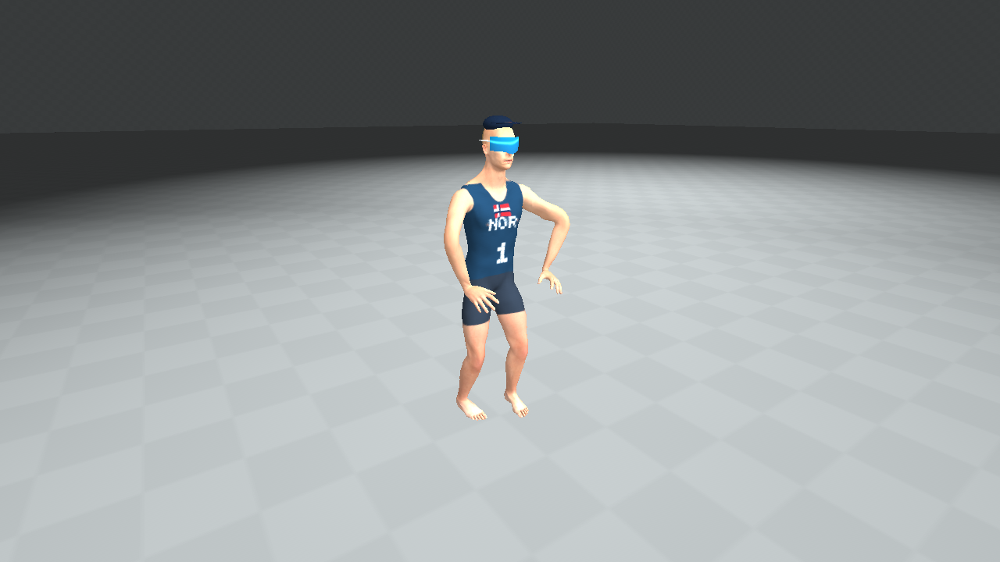 | 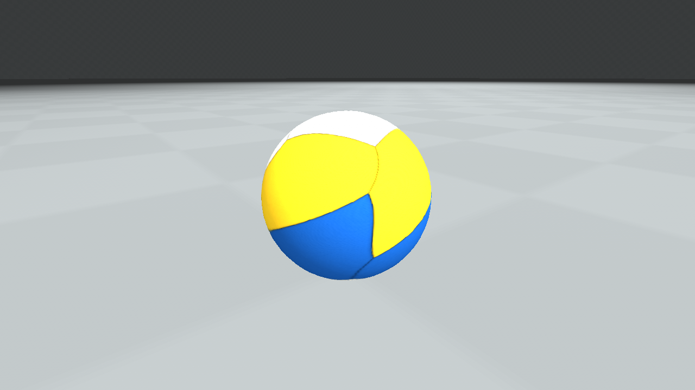 |

| Court and net | Padding and hardware |
| --- | --- |
| 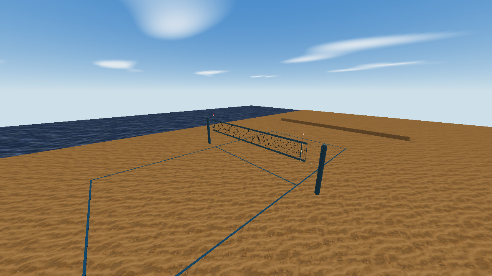 | 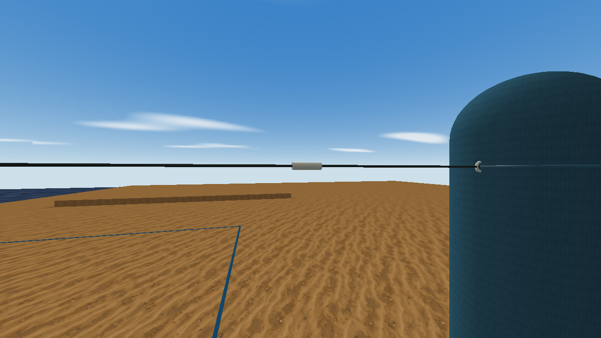 |

The body has **31 clips / 389 poses**; first-person hands have **32 clips / 402
poses**. [Athlete notes](docs/player.md) · [Hand notes](docs/hands.md) ·
[Model detail and budgets](docs/model-detail.md)

</details>

All screenshots above were captured from the current game and engine, with 4×
anti-aliasing. Live scenes and fixed poses are identified in the
[capture manifest](docs/screenshots/review.json), alongside image and build hashes.

## Build the latest

Use a current [QSS-M](https://github.com/timbergeron/QSS-M) build for native
rounded HUD panels. Older engines use square panels.

You need Python 3.10+, [md3harness](https://github.com/timbergeron/md3harness),
[FTEQCC](https://github.com/fte-team/fteqw), and
[ericw-tools](https://github.com/ericwa/ericw-tools). Clone md3harness beside this
repository or install its Python package, then run from the repository root:

```sh
python3 build.py --basedir /path/to/quake \
  --fteqcc /path/to/fteqcc \
  --qbsp /path/to/qbsp --vis /path/to/vis --light /path/to/light

python3 run.py --bin /path/to/quakespasm --basedir /path/to/quake --window
```

The build writes `dist/beachvolley` and an install ZIP. The launcher keeps its
runtime and configs in the mod checkout and reads your Quake PAKs through links.
[Setup, asset generation, and verification →](docs/development.md)

## Go deeper

| For players | For makers |
| --- | --- |
| [Controls and shot timing](docs/gameplay.md#controls) | [Build and test](docs/development.md) |
| [Doubles rallies](docs/gameplay.md#doubles-rallies) | [Athlete animation](docs/player.md) · [First-person hands](docs/hands.md) |
| [Physics and tuning](docs/gameplay.md#physics-and-tuning) | [Texture painting kit](docs/texture-authoring.md) · [Model budgets](docs/model-detail.md) |

Preparation and positioning take inspiration from *Virtua Tennis*. Contact,
flight, and volleyball motions are authored here. Physics and assistance values
are tuned for play rather than calibrated as a sports simulation.
[Design and upstream credits →](THIRD_PARTY.md)

## License

Copyright © 2026 timbergeron. Original source and generated assets use
[GPL-2.0-or-later](LICENSE). Prepared MakeHuman body/hand source and skin are
[CC0](resources/anatomy/LICENSE.CC0.txt). See [third-party credits](THIRD_PARTY.md).
Quake game data is required separately and is not included.
