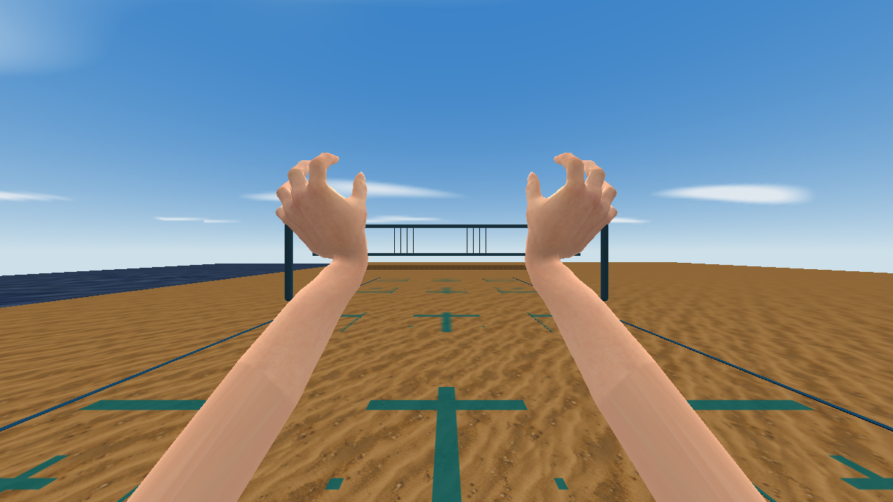

# Anatomical first-person volleyball hands

The view model uses continuous hands with knuckles, nail beds, thumb webbing,
palm contours and a separate 512×2048 skin atlas. Three joints per finger and
opposed thumbs allow a setting cradle without mitten-shaped palms or separate
cylinders. Arms continue behind the camera to keep their cropped ends hidden.

The mesh, anatomy target, joint locations, weights and skin are trimmed CC0
MakeHuman assets. The rig source records their pinned revision and hashes in
`resources/hands/hand-rig.json`; licensing and credits are in `THIRD_PARTY.md`.
All skinning, camera framing and volleyball animations are authored here.
Dual quaternion skinning preserves finger and wrist volume during flexion.
QSS-M uses textured alias lighting; this asset does not require a PBR renderer.



## Motion

- Deep dish: hands rise near the forehead, fingers spread and flex through
  three joints, thumbs oppose, and wrists yield into a cradle before extending
  through the ball and relaxing. The ball is never attached to the animation.
- Float serve: the guide hand opens beneath the toss; the hitting elbow draws
  back, the palm stays firm through contact, and the hand pushes forward before
  returning. This avoids a spike-style wrist snap in the float motion.
- Cut shots: the forearm and wrist turn across the ball, with separate inward
  and wrist-away follow-throughs. A short spike (`F`, depth below −0.2) whose
  stored heading turns more than about 20° during preparation (`Shift` + mouse)
  selects a cut at contact. Turning to the hitting side selects wrist-away.
  Spin controls alone do not select a cut.

Ready, platform passes, attack approach, bow preparation, rolls, blocks, digs
and recovery have matching camera-space poses. Existing game physics owns
contacts and placement. The model contains 402 poses sampled at 24 Hz: the
first 389 retain the body frame ranges; 13 additional poses supply wrist-away.
Live play sends frames at Quake's 0.1-second alias interpolation cadence.

## Build and review

```sh
python3 hand_assets.py --output build/hand-candidate --reports build/hand-quality
python3 hand_review.py --game build/hand-candidate --reports build/hand-quality
python3 -m unittest -v test_hand_assets
```

Open `build/hand-review/hands.html` to play, scrub, and slow down the exact
exported MD3. First person uses a 90° horizontal camera; Inspect lets you orbit.
The model's SHA-256 is shown in the page. The normal `build.py` asset generation
also invokes this hand generator and packages its texture and clip manifest.
Export into a fresh staging directory, then copy only a successful candidate.
The generator validates batches before assembling and checking all 402 frames.
Exact repeated poses reuse their packed vertices; frame labels and timing remain
unchanged. This keeps the exporter usable on machines with limited memory.

Actual first-person QSS-M captures:

```sh
python3 hand_view.py --bin /path/to/quakespasm --basedir /path/to/quake
```

This captures ready, the setting cradle and release, float preparation/contact,
and both cuts in `artifacts/hands-qssm`. Capture metadata records exact frames
and engine/model/skin hashes. The optional `bv_handview` fixture is disabled
during normal play. `test_mod.py --case gameplay` exercises cut selection and
serve timing in the actual QC VM.

## Source extraction

Normal builds need only Python's standard library and `../md3harness`. To redo
the source extraction, install Pillow in a separate tooling environment, fetch
the inputs listed by `prepare_hand_source.py`, and run that script. It crops the
hand skin without rescaling, adds a forearm strip sampled from nearby skin,
slices the forearm into a clean attachment ring, and welds millimetre-scale
nail bevels that cannot survive MD3's 1/64-unit position grid. Skin weights and UVs remain reproducible from
the pinned input files; the full character mesh and texture are not shipped.

At the pinned MakeHuman revision, the source paths are
`makehuman/data/3dobjs/base.obj`, `makehuman/data/rigs/default.mhskel`,
`makehuman/data/rigs/default_weights.mhw`, and
`makehuman/data/targets/macrodetails/caucasian-male-young.target` (save as
`male.target`). The CC0 system asset pack supplies
`skins/young_caucasian_male/young_lightskinned_male_diffuse.png` (save as
`skin.png`). Save the asset license as `LICENSE.ASSETS.md` beside these files.
